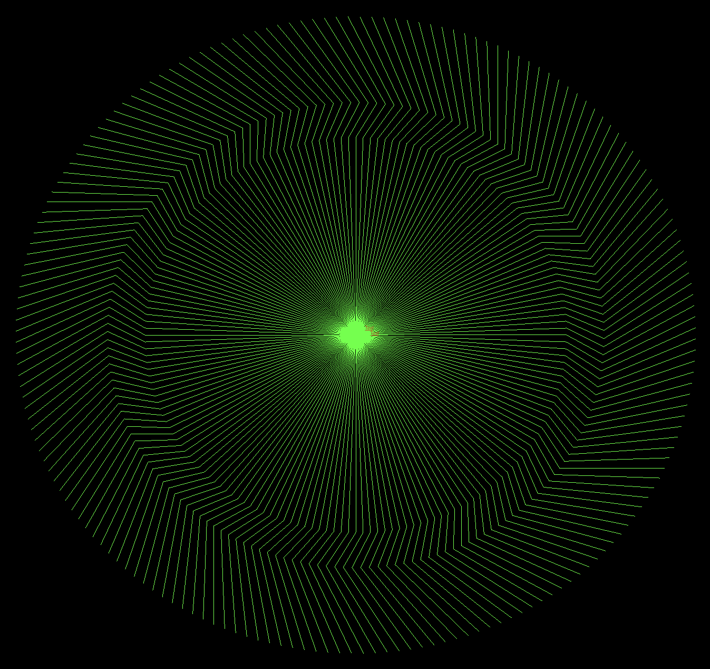

# GL_turtle
A turtle library implemented with **OpenGL** via GLFW+GLAD

Initiate a Turtle object and let it clime!

## Intro
We have enabled these methods:

- **Turtle.init** : initialize the libraries
- **Turtle.show** : Setup screen
- **Turtle.forward** : Turtle move forward with current direction
- **Turtle.right** : Turtle's direction turned to right with input degrees
- **Turtle.left** : Turtle's direction turned to left with input degrees
- **Turtle.setPosition** : Reset the position of turtle
- **Turtle.penup** : Stops drawing when turtle moves
- **Turtle.pendown** : Start drawing when turtle moves
- **Turtle.color** : Change the color of later lines
- **Turtle.circle** : Draw a circle!

## Usage
```cpp
Turtle turtle = Turtle();
turtle.init();
turtle.color(0, 1, 0);

for (int i = 0; i < 180; i++)
{
    turtle.forward(100*4);
    turtle.right(30);
    turtle.forward(20*4);
    turtle.left(60);
    turtle.forward(50*4);
    turtle.right(30);

    turtle.penup();
    turtle.setPosition(0, 0);
    turtle.pendown();

    turtle.right(2);
}

turtle.show();
```

## Demo
